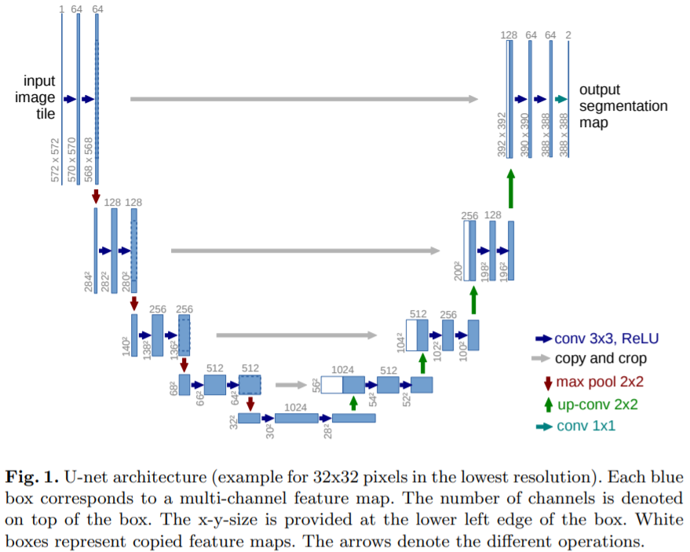

# DeepFake

## **1. FSGAN: Subject Agnostic Face Swapping and Reenactment**
paper link: https://arxiv.org/abs/1908.05932

## **1.1 Train**
It is still being prepared.
```
& python main.py --
```

## **1.2 Test**
It is still being prepared.
```
& python main.py --
```

## **Directors structure**
```
FACE-SWAPPING
+---[models]
|   +---__init__.py
|   |---unet.py
|
+---[utils]
|   +---__init__.py
|   |---bbox_utils.py
|   |---confusion_matrix.py
|   |---image_utils.py
|   |---iou_metric.py
|   |---landmark_utils.py
|   |---logger.py
|   |---seg_utils.py
|   |---utils.py
```

### Models

1. UNet

